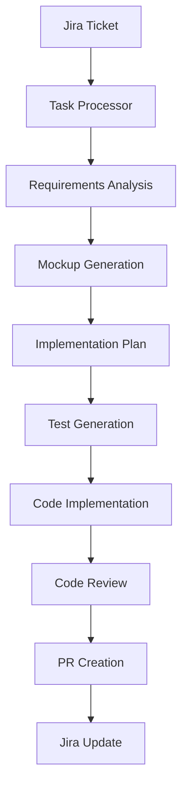

# 🤖 Copilot Task Processor

> Enterprise-grade AI-powered development workflow automation system

[](https://www.typescriptlang.org/)
[](https://nodejs.org/)
[](LICENSE)
[](https://github.com/features/actions)

## 🎯 Overview

Copilot Task Processor is a production-ready, enterprise-grade automation framework that transforms Jira tickets into fully tested, production-ready pull requests using GitHub Copilot AI.

### Key Features

- 🎫 **Jira Integration**: Direct integration with Atlassian Jira via MCP
- 🤖 **AI-Powered Development**: Leverages GitHub Copilot for code generation
- 🎨 **Mockup Generation**: Creates visual mockups before implementation
- 🧪 **Test-Driven**: Generates comprehensive test suites automatically
- 🌿 **Git Flow**: Automated branch creation and PR management
- 📊 **Progress Tracking**: Real-time task status updates in Jira
- 🔒 **Enterprise Security**: Built with security-first principles
- 📈 **Observable**: Comprehensive logging and metrics

## 🏗️ Architecture



## 🚀 Quick Start

### Prerequisites

- Node.js 20+
- Git
- GitHub Copilot access
- Jira account with API access
- VS Code with Copilot extensions

### Installation

```bash
# Clone repository
git clone https://github.com/dapio/copilot-task-processor.git
cd copilot-task-processor

# Install dependencies
npm install

# Configure environment
cp .env.example .env
# Edit .env with your credentials

# Run initial setup
npm run setup
```

### Usage

```bash
# Process a Jira ticket
npm run process -- --ticket PROJ-123

# Interactive mode
npm run process:interactive

# Batch processing
npm run process:batch -- --filter "status=TODO AND assignee=currentUser()"
```

## 📁 Project Structure

```
copilot-task-processor/
├── .github/
│   ├── workflows/          # CI/CD pipelines
│   ├── copilot/           # Copilot instructions
│   └── CODEOWNERS         # Code ownership
├── docs/                  # Documentation
│   ├── architecture/      # System architecture
│   ├── api/              # API documentation
│   └── guides/           # User guides
├── src/
│   ├── core/             # Core processing engine
│   ├── integrations/     # External integrations
│   ├── generators/       # Code/mockup generators
│   ├── validators/       # Quality validators
│   └── utils/            # Utilities
├── templates/            # Task templates
├── config/              # Configuration files
└── tests/               # Test suites
```

## 🔧 Configuration

See [Configuration Guide](docs/guides/configuration.md) for detailed setup instructions.

## 📚 Documentation

- [Getting Started](docs/guides/getting-started.md)
- [Architecture Overview](docs/architecture/overview.md)
- [API Reference](docs/api/reference.md)
- [Contributing Guidelines](CONTRIBUTING.md)

## 🤝 Contributing

We welcome contributions! Please see [CONTRIBUTING.md](CONTRIBUTING.md) for details.

## 📄 License

MIT License - see [LICENSE](LICENSE) file for details.

## 🙏 Acknowledgments

Built with enterprise-grade standards and best practices from leading tech companies.

---

**Made with ❤️ by dapio**
