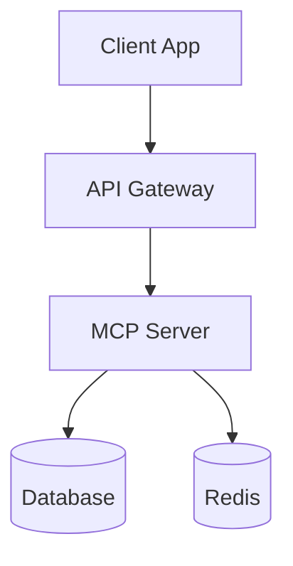

# System Architecture

## High-Level Overview

## Components

### 1. API Layer
- **Technology**: Express.js / Fastify
- **Responsibility**: HTTP endpoints, authentication
- **Scaling**: Horizontal

### 2. MCP Server
- **Technology**: @modelcontextprotocol/sdk
- **Responsibility**: AI context, tools, prompts
- **Scaling**: Vertical initially

### 3. Data Layer
- **Technology**: PostgreSQL + Prisma
- **Responsibility**: Persistent storage